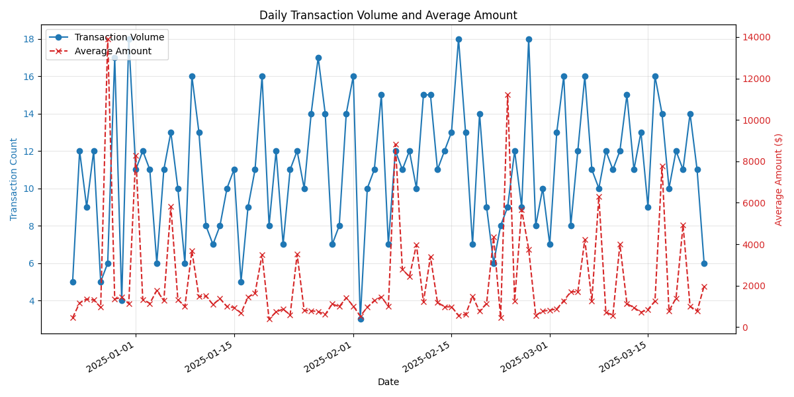
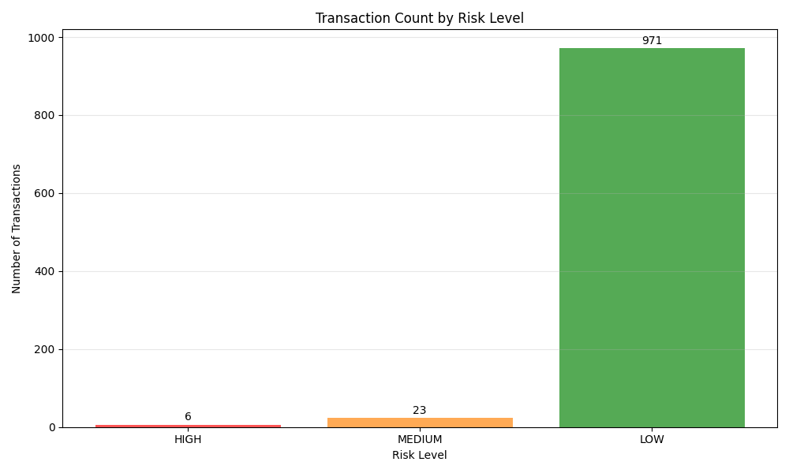

# Enterprise Financial Transaction Risk & Fraud Analytics Pipeline

## Overview

This project is an autonomous pipeline designed for enterprise financial systems that processes simulated transaction data for basic heuristic risk and fraud analytics. It's a self-contained solution that spans data generation, data processing, risk assessment, and visualization—delivering actionable insights without external services or cloud dependencies.

It was implemented end-to-end by [Exponent](https://exponent.run) and you can view the whole process here: https://www.exponent.run/share/0fdc926a-c594-4e3c-a8d9-6724a7829d55

## Output

After running the pipeline, you'll find:

1. **Transaction Data**:

   - CSV file: `fraud_pipeline/data/transactions.csv`
   - DuckDB database: `fraud_pipeline/data/transactions.duckdb`

2. **Visualizations**:

   - Transaction Volume Chart:
     
   - Risk Distribution Chart:
     

3. **Reports**:
   - Summary Report (Markdown): `fraud_pipeline/output/risk_report.md`

## Key Features

### Data Generation

- Simulates realistic financial transactions including deposits, withdrawals, and transfers
- Generates both normal transactions and crafted scenarios with potential fraud indicators
- Includes detailed attributes such as transaction IDs, account numbers, timestamps, amounts, and merchant codes

### Orchestrated Workflow

- Automates the entire pipeline from data ingestion to visualization
- Provides real-time progress tracking with detailed logs and status updates
- Uses Prefect for robust task orchestration and monitoring

### Data Processing

- Cleanses and standardizes raw transaction data
- Enriches data with basic metrics such as hour of day
- Prepares data for risk assessment through feature engineering

### Heuristic Risk Assessment

- Applies threshold-based risk scoring:
  - Large Transaction Amount: Flags unusually high amounts
  - Odd-hour Activity: Flags transactions during unusual hours
  - Transaction Velocity: Flags accounts with many transactions in a short period
  - Suspicious Merchant: Flags transactions with suspicious merchant codes
- Assigns risk scores and categorizes transactions into High, Medium, and Low risk levels
- Provides detailed risk assessment metrics and validation against known fraud cases

### Local Database Storage

- Uses DuckDB, a high-performance analytical database
- Enables SQL Queries for flexible analysis of transaction data
- Operates entirely locally with no server setup required

### Visualization & Reporting

- Generates interactive dashboards:
  - A line chart depicting transaction volumes and average transaction amounts over time
  - A bar chart showing the distribution of risk levels
  - A chart illustrating detection performance (true positives, false negatives, etc.)
- Produces a comprehensive summary report of risk assessments and flagged transactions

## Project Structure

```
fraud_pipeline/
├── data/              # Directory storing generated and processed data
│   ├── transactions.csv      # Generated transaction data
│   └── transactions.duckdb   # DuckDB database
├── output/            # Visualizations and reports output
│   ├── transaction_volume.png       # Transaction volume chart
│   ├── risk_distribution.png        # Risk level distribution chart
│   ├── risk_distribution_detection.png  # Fraud detection results
│   └── risk_report.md               # Summary report
├── src/               # Source code
│   ├── data_generation.py    # Data generation module
│   ├── data_loading.py       # Data loading module
│   ├── risk_analysis.py      # Risk analysis module
│   └── visualization.py      # Visualization module
├── tests/             # Unit tests
├── main.py            # Main orchestration script
├── Dockerfile         # Dockerfile for containerization
└── README.md          # Project documentation
```

## Getting Started

### Prerequisites

- Python 3.10+ with pip
- Docker (optional, for containerized execution)

### Installation

1. Clone the repository

   ```bash
   git clone https://github.com/yourusername/fraud_pipeline.git
   cd fraud_pipeline
   ```

2. Create and activate a virtual environment

   ```bash
   python -m venv venv
   source venv/bin/activate  # On Windows, use: venv\Scripts\activate
   ```

3. Install dependencies
   ```bash
   pip install -r requirements.txt
   ```

### Usage

Run the complete pipeline:

```bash
python fraud_pipeline/main.py
```

Options:

- `--transactions`: Number of transactions to generate (default: 1000)
- `--fraud`: Ratio of fraudulent transactions (default: 0.05)

Example:

```bash
python fraud_pipeline/main.py --transactions 5000 --fraud 0.1
```

### Docker Usage

Build and run with Docker:

```bash
docker build -t fraud-pipeline .
docker run -it --rm -v $(pwd)/fraud_pipeline/output:/app/fraud_pipeline/output fraud-pipeline
```

## Risk Assessment Methodology

The risk assessment uses a heuristic, rule-based approach with the following rules:

1. **Large Transaction Amount**:

   - Withdrawals > $2,000
   - Transfers > $3,000
   - Payments > $5,000

2. **Odd Hours Activity**:

   - Transactions between midnight and 4 AM

3. **Suspicious Merchant**:

   - Transactions with merchants containing 'SUSPICIOUS' in their code

4. **Transaction Velocity**:
   - 3+ transactions from the same account within a 1-hour window

Each rule contributes to a weighted risk score, which is then categorized:

- **HIGH risk**: Score >= 50
- **MEDIUM risk**: Score >= 30
- **LOW risk**: Score < 30

## Limitations and Future Improvements

- The current implementation uses simple heuristic rules; a machine learning approach could improve detection
- The data simulation is simplified; real-world data would be more complex
- Performance could be improved for larger datasets
- Additional visualization types could be added
